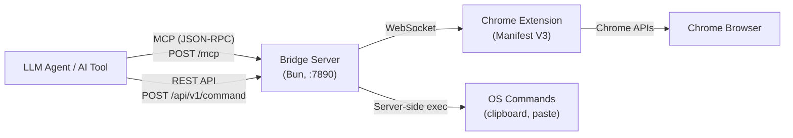

# Chrome Bridge

MCP-native browser automation bridge for LLM agents. Control Chrome via MCP (Model Context Protocol) or REST API.

## Architecture



**Two interfaces:**
- **MCP** (primary) — `POST /mcp` with JSON-RPC. Used by Claude, Cursor, and other MCP-compatible tools.
- **REST** (secondary) — `POST /api/v1/command`. Backward-compatible HTTP API.

**Two execution paths:**
- **Extension commands** — Sent to Chrome Extension via WebSocket (navigate, click, screenshot, etc.)
- **Server-side commands** — Execute directly on the server machine (clipboard write, OS paste)

## Quick Start

```bash
# Install dependencies
bun install

# Start the server (auth disabled by default — no keys needed)
bun src/server.ts

# Or with auto-reload during development
bun --watch src/server.ts
```

The server starts at `http://127.0.0.1:7890` with both MCP and REST enabled.

### Load the Chrome Extension

```bash
# Build the extension
bun extension/build.ts

# Load in Chrome:
# 1. Open chrome://extensions/
# 2. Enable Developer Mode
# 3. Click "Load unpacked" → select extension/dist/
```

Click the extension icon, enter `http://localhost:7890`, and connect.

### MCP Configuration

Add to your MCP client config (e.g. Claude Desktop, Cursor):

```json
{
  "mcpServers": {
    "chrome-bridge": {
      "url": "http://127.0.0.1:7890/mcp"
    }
  }
}
```

### REST API Example

```bash
# List tabs
curl -X POST http://localhost:7890/api/v1/command \
  -H "Content-Type: application/json" \
  -d '{"command": "tab.list"}'

# Navigate
curl -X POST http://localhost:7890/api/v1/command \
  -H "Content-Type: application/json" \
  -d '{"command": "navigate", "params": {"url": "https://example.com"}}'
```

When auth is enabled, add `-H "Authorization: Bearer bby_YOUR_KEY"`.

## Commands

### Browser Commands (via Chrome Extension)

| MCP Tool Name | Extension Command | Params | Description |
|---------------|-------------------|--------|-------------|
| `browser_navigate` | `navigate` | `url, tabId?` | Navigate to URL |
| `browser_tab_list` | `tab.list` | — | List all tabs |
| `browser_tab_create` | `tab.create` | `url?` | Create new tab |
| `browser_tab_close` | `tab.close` | `tabId` | Close a tab |
| `browser_click` | `click` | `selector, tabId?` | Click an element |
| `browser_type` | `type` | `selector, text, tabId?` | Type text into element |
| `browser_press` | `press` | `key, modifiers?, tabId?` | Press a key |
| `browser_scroll` | `scroll` | `x?, y?, selector?` | Scroll page or element |
| `browser_query` | `query` | `selector, attrs?, tabId?` | Query DOM elements |
| `browser_query_text` | `query.text` | `selector, tabId?` | Get element text |
| `browser_wait` | `wait` | `selector, timeout?, tabId?` | Wait for element |
| `browser_screenshot` | `screenshot` | `tabId?` | Capture visible tab |
| `browser_evaluate` | `evaluate` | `expression, tabId?` | Execute JavaScript (disabled by default) |
| `browser_cookie_get` | `cookie.get` | `url, name?` | Get cookies |
| `browser_cookie_set` | `cookie.set` | `cookie` | Set a cookie |
| `browser_file_set` | `file.set` | `selector, paths[]` | Set file input |
| `browser_clipboard_write` | `clipboard.write` | `text?/html?/imageBase64?` | Write to browser clipboard |

### Server-Side Commands (no extension needed)

| MCP Tool Name | Description |
|---------------|-------------|
| `os_clipboard_write` | Copy image file or HTML to system clipboard |
| `os_paste` | Send real OS-level paste keystroke (Cmd+V / Ctrl+V) |

These run directly on the server machine. Use `os_clipboard_write` + `os_paste` to paste images into web apps that reject synthetic clipboard events (X/Twitter, WeChat, Slack, etc.).

## Plugins

Built-in plugins extend the command set:

- **x.post** — `{"command": "x.post", "params": {"text": "Hello!", "images": [...]}}`
- **wechat.post** — `{"command": "wechat.post", "params": {"title": "...", "html": "..."}}`

## API Keys & Auth

Auth is **optional by default**. When no keys exist, all requests are accepted without authentication.

```bash
# Generate an API key (enables auth for all requests)
bun src/server.ts keygen --name "my-agent"

# Generate a restricted key (only allowed specific commands)
bun src/server.ts keygen --name "reader" --commands browser_tab_list,browser_screenshot

# Generate an IP-restricted key
bun src/server.ts keygen --name "local" --ip 127.0.0.1

# List keys
bun src/server.ts keys

# Revoke a key by prefix
bun src/server.ts revoke bby_abc1
```

## TypeScript Client

```typescript
import { ChromeBridge } from "./client"

const bridge = new ChromeBridge({
  url: "http://127.0.0.1:7890",
  apiKey: "bby_your_key_here", // optional
})

await bridge.navigate("https://example.com")
await bridge.wait("h1")
const text = await bridge.queryText("h1")
console.log(text.result)

// OS-level clipboard + paste
await bridge.copyToClipboard({ imagePath: "/path/to/image.png" })
await bridge.paste({ app: "Google Chrome" })
```

## Configuration

All settings are via environment variables:

| Variable | Default | Description |
|----------|---------|-------------|
| `PORT` | `7890` | Server port |
| `HOST` | `127.0.0.1` | Bind address |
| `ENABLE_EVALUATE` | `false` | Enable JavaScript evaluation |
| `MCP_ENABLED` | `true` | Enable MCP endpoint |
| `REST_ENABLED` | `true` | Enable REST endpoint |
| `RATE_LIMIT` | `60` | Requests per window per key |
| `RATE_WINDOW` | `60000` | Rate limit window (ms) |
| `COMMAND_TIMEOUT` | `30000` | Command timeout (ms) |
| `CORS_ORIGIN` | `""` | CORS allowed origin |
| `CONFIG_DIR` | `~/.config/chrome-bridge` | Config/key storage directory |

## Security

- Auth optional by default — enable by generating an API key
- WebSocket extension connection is localhost-only with origin validation
- Key store uses atomic writes with restrictive file permissions (0600)
- `evaluate` command disabled by default (arbitrary JS execution)
- Rate limited per key
- Keys can be restricted to specific commands and/or IP addresses
